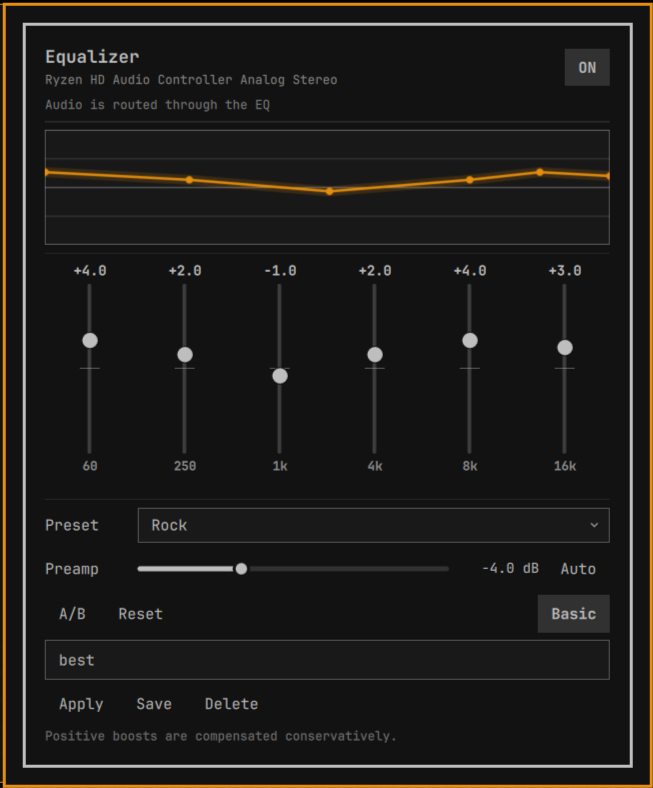

# Omarchy Equalizer

`equalizer` is a native Quickshell/Quattro bar widget backed by one WirePlumber-managed PipeWire filter-chain smart sink. It provides six bands at 60 Hz, 250 Hz, 1 kHz, 4 kHz, 8 kHz and 16 kHz, persistent state, built-in/user presets, and recovery-friendly diagnostics.



## Install and enable

Install this directory with the current Omarchy plugin manager, then add `omarchy.equalizer` to the bar layout (or use the plugin manager’s Enable action). Restart/reload the Omarchy shell using the current supported command. No second Quickshell instance, root access, system config, network access, or daemon installation is required.

The QML entry point invokes the bundled `backend/eqctl` directly, so a separate system installation of `eqctl` is not required.

# Architecture

```text
Widget.qml / EqualizerPanel.qml
          ↓ validated, debounced arguments
       eqctl
          ↓ state + live Props.params update
WirePlumber smart sink: input.omarchy.equalizer
          ↓ filter-chain DSP
  omarchy_equalizer_output
          ↓
   physical PipeWire sink
```

The UI owns presentation and sends only a fixed command vocabulary. `eqctl` owns schema validation, atomic persistence, preset data, device snapshots, graph creation, runtime control updates, and diagnostics. The six-band UI is a view over an N-filter model; the JSON format already carries frequency, Q and filter type for future parametric/AutoEQ support.

State is explicit in the controller (`ready`, enabled/bypassed, device, preset, graph and route status). QML never parses human-readable command output. Runtime updates discover the smart filter node from structured `pw-dump`, locate its named `eq_band_N:*` and `preamp:*` controls in `Props.params`, and send `{"params":[name,value]}` with `pw-cli set-param`. Graph creation/recovery writes the plugin-owned WirePlumber fragment and restarts only WirePlumber; it never starts a second PipeWire daemon.

The current Quattro contract is the installed `schemaVersion: 1` manifest, `WidgetButton`, `Panel`, `KeyboardPanel`, `BorderSurface`, `Button`, and `qs.Commons` theme tokens. The bar widget owns its anchored panel instance, which is the live bar-widget pattern used by current first-party-compatible plugins.

## CLI

```text
eqctl status [--json]       eqctl get [--json]
eqctl enable|disable|toggle eqctl reset
eqctl set-band INDEX GAIN   eqctl set-preamp GAIN
eqctl auto-preamp
eqctl preset list|apply NAME|save NAME|delete NAME
eqctl device list|current|profile ID
eqctl diagnostics --json
```

All values are bounded and finite. `--json` is intended for QML and automation. Preset names are data, never shell fragments.

## Presets and profiles

Built-ins are immutable JSON data in `presets/`. User presets and state live below `~/.config/omarchy/equalizer/`, separate from plugin code. The controller also owns `~/.config/wireplumber/wireplumber.conf.d/omarchy-equalizer.conf`; it contains only the graph definition and is regenerated when the graph is missing or its shape changes. State is versioned and written through a flushed temporary file followed by atomic rename. Invalid state is preserved as `state.invalid.TIMESTAMP.json` and replaced with safe defaults.

The default mode is `per-device`; stable PipeWire node names are used for device profile keys when available. A missing device never deletes its profile.

## Audio design

The backend creates one smart sink with a real filter-chain containing a 20 Hz low-shelf preamp plus `bq_lowshelf`, four `bq_peaking` filters, and `bq_highshelf`. Applications link to the smart sink and its output links to the physical default sink. Slider changes update the filter node’s named `Props.params` in place via `pw-cli set-param`; normal controls do not restart PipeWire, WirePlumber, Quickshell, or the shell. WirePlumber is restarted only when the EQ graph must be created or recovered.

Auto-preamp is the negative maximum positive EQ gain. Reset means zero band gain and zero preamp and disables auto-preamp. Disable keeps the graph and route usable but applies flat filter gains; enable reapplies the saved live gains.

## Troubleshooting

Run `eqctl diagnostics --json`, verify `pw-dump` and `wpctl` are available, and check that the user PipeWire session is running. After a PipeWire restart, reopen the panel; the controller retries the status path and reapplies saved values. If the device is unplugged, its saved profile remains.

## Security

The plugin runs unsandboxed inside Quickshell, so the backend is intentionally narrow. It uses direct executable argument arrays, never `sh -c`, `eval`, privilege escalation, network access, telemetry, or arbitrary PipeWire command forwarding. Inputs, JSON, preset names, frequencies, gains, Q values, and profile sizes are bounded. It writes only the equalizer state/preset directory and its own WirePlumber fragment.

## Personal Note

The plugin is completely vibecoded, other than this line.
